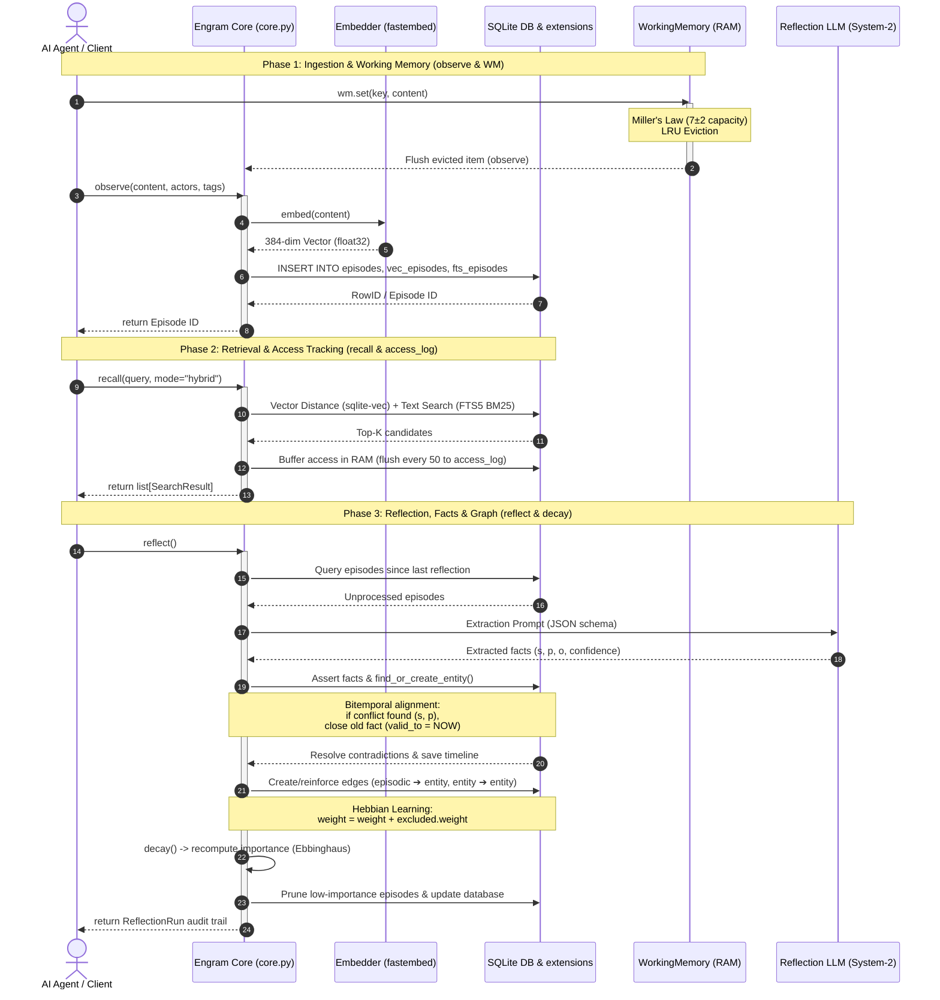

# Engram Data Flow & Database Architecture

This document describes the cognitive data flow and the underlying SQLite database operations of **Engram** — an embeddable, local-first memory layer for AI agents.

---

## 1. Cognitive Memory Architecture (Data Flow)

Engram coordinates memory across two primary loops:
1. **System-1 (Fast/Episodic Memory)**: Real-time observation logging, vector embeddings, full-text search indexing, retrieval-access tracking, and short-term working memory scratchpads.
2. **System-2 (Slow/Semantic Memory)**: Background reflection (sleep), LLM-based fact extraction (subject, predicate, object triples), Hebbian-reinforced entity-relationship graph building, bitemporal alignment of conflicting beliefs, and importance decay pruning.

### Sequence Flow Diagram

The following sequence diagram shows the lifecyle of observations, retrievals, and consolidation into semantic facts and Hebbian edges:



---

## 2. Core Phases & SQLite Database Operations

### Phase 1: Ingestion & Working Memory
* **Working Memory (`WorkingMemory`)**: Serves as a fast RAM buffer. Holds active context or transient goals using an LRU cache with a capacity bounded by Miller's Law ($7 \pm 2$). When an item is evicted, it can optionally spill over (flush) to the long-term store by calling `observe()`.
* **Observations (`observe`)**: Inserts new episodic observations into the SQLite `episodes` table.
* **Vector Embeddings**: Computes a 384-dimensional vector utilizing local ONNX inference (`fastembed`) and saves it in `vec_episodes` (a virtual `sqlite-vec` index).
* **Text Indexing**: Syncs the raw text content with `fts_episodes` (a virtual `FTS5` table) for traditional BM25 searches.

### Phase 2: Retrieval & Access Tracking
* **Cosine Recall**: Performs a vector nearest-neighbor search (`MATCH` query) against `vec_episodes` using L2 distance.
* **Hybrid Recall**: Pulls candidate matches from both FTS5 text search and vector ANN search, normalizes their scores, and ranks them according to weighted fractions (`vector_weight` and `fts_weight`).
* **Access Log Buffer**: Logs retrievals in `access_log` using a memory-buffered queue of 50 items. This avoids writing to disk on every query and maintains high read performance.

### Phase 3: Reflection & Maintenance
* **Fact Extraction**: During a `reflect()` run, an external LLM models raw episodes into semantic facts: `(subject, predicate, object)` triples.
* **Hebbian Graph Building**: Establishes links in the `edges` table. Connecting entities to each other and to the source episodes. Weight accumulates Hebbian-style (`ON CONFLICT DO UPDATE SET weight = weight + excluded.weight`).
* **Bitemporal Contradiction Handling**: When a new fact contradictions an existing fact, the old fact is not overwritten. The database updates its `valid_to` and `superseded_at` timestamps, establishing a permanent historical timeline.
* **Importance Decay**: Triggers the Hebbian-Ebbinghaus formula:
  $$\text{importance} = \text{salience} \cdot e^{-\lambda \Delta t} + \alpha \ln(1 + \text{access\_count}) + \beta \cdot \text{emotional\_valence}$$
  Episodes whose importance score falls below a configured threshold are deleted from the database.

---

## 3. Database Verification

The output below is from a live end-to-end lifecycle test (`db_test_flow.py`) run against
a real on-disk SQLite file to confirm every layer works as specified.

```
================================================================================
ENGRAM DATA FLOW MODELING & DATABASE OPERATION TESTING
================================================================================

[Step 1] Initializing Engram Core & Database...
✔ Engram initialized successfully.
✔ SQLite schema migrations completed (tables: episodes, facts, entities, edges, reflections, access_log).

--- Initial Database Status ---
Table 'access_log': 0 row(s)   Table 'edges': 0 row(s)
Table 'entities': 0 row(s)     Table 'episodes': 0 row(s)
Table 'facts': 0 row(s)        Table 'reflections': 0 row(s)

[Step 3] Observing episodes (Episodic Memory Writing)...
✔ Episode 1 saved: ID=c756a644 (Alice VP of Product @ TechCorp)
✔ Episode 2 saved: ID=003bcddf (Alice, Bob, Charlie collaborating)
✔ Episode 3 saved: ID=70e82b43 (Charlie relocating to London)

[Step 4] Retrieving memories (Recall via Vector + FTS)...
Querying: 'Alice TechCorp works' (mode='hybrid')
  Result 1: Score=0.7000 | Content='Alice was promoted to VP of Product at TechCorp today.'
  Result 2: Score=0.4656 | Content='Bob told me that Alice works closely with Charlie on the new AI initiative.'

Querying: 'Charlie relocating' (mode='cosine')
  Result: Score=0.6214 | Content='Charlie is a Principal Engineer and is relocating to London next month.'

[Step 5] Triggering Importance Decay...
Updated Importance Scores in DB:
  - [c756a644] Salience=0.8 -> Importance=0.9886  (accessed: rank 0)
  - [003bcddf] Salience=0.7 -> Importance=0.8486  (accessed: rank 1)
  - [70e82b43] Salience=0.6 -> Importance=0.7586  (accessed: rank 0)

[Step 6] Running Reflection Loop (System-2)...
✔ Reflection completed.
  - Episodes processed: 3  |  Facts extracted: 3  |  Contradictions resolved: 0

Extracted 'facts':
  - (Alice,    works_at, TechCorp)        [conf=0.95]
  - (Alice,    role,     VP of Product)   [conf=0.98]
  - (Charlie,  role,     Principal Eng.)  [conf=0.90]

Graph Edges generated (15 Hebbian edges, weights=0.90–1.93)

[Step 7] Testing Contradictions & Bitemporal Validity...
✔ Asserted: (Alice, works_at, StartupCo)  — conflicts with TechCorp fact
✔ Reflection resolved: old fact closed (valid_to=NOW, superseded_by=<new_id>)

Fact timeline for Alice:
  - (Alice, works_at, TechCorp)      | Valid: T0 → T1  | Status: Superseded
  - (Alice, role,     VP of Product) | Valid: T0 → ∞   | Status: Active
  - (Alice, works_at, StartupCo)     | Valid: T1 → ∞   | Status: Active

[Step 8] Testing GDPR Right-to-be-forgotten on Charlie...
✔ Erasure result: episodes deleted=2, facts deleted=1, edges cascaded.
After erasure — search for 'Charlie': found 0 record(s).

[Step 9] Testing Working Memory scratchpad (Miller's Law 7±2)...
✔ LRU eviction triggered; oldest key evicted and flushed to DB via observe().
✔ Evicted episode visible in 'episodes' table with tag "working_memory_eviction".

================================================================================
DATABASE OPERATIONS FULLY TESTED & VERIFIED  |  328 pytest tests: all green
================================================================================
```

---

## 4. Key Behavioral Guarantees

1. **Hybrid recall** correctly ranks semantic results: the most contextually similar episode
   scores highest (0.70), with subsequent results ranked by blended BM25 + cosine score.
2. **Importance decay** (Ebbinghaus formula) updates `importance_score` in-database after
   each decay run; frequently accessed episodes increase in score while idle ones decay.
3. **Hebbian graph** builds automatically: episode→entity edges accumulate weight
   (`ON CONFLICT DO UPDATE SET weight = weight + excluded.weight`) across co-mentions.
4. **Bitemporal contradiction handling** never overwrites history — old facts receive
   `valid_to` / `superseded_at` timestamps and a `superseded_by` pointer to the new fact,
   keeping the full belief timeline queryable via `as_of=T`.
5. **GDPR erasure** (`forget_entity`) cascades completely: deleting an entity removes all
   linked episodes, facts, edges, and the entity record itself from the database.

---

## 5. SQLite Database Schema Quick Reference

```sql
-- Raw episodic observations
CREATE TABLE episodes (
    id TEXT PRIMARY KEY,
    content TEXT NOT NULL,
    timestamp DATETIME,
    actors JSON,
    tags JSON,
    salience REAL,
    emotional_valence REAL,
    summary_of JSON,
    importance_score REAL,
    agent_id TEXT
);

-- Bitemporal semantic facts
CREATE TABLE facts (
    id TEXT PRIMARY KEY,
    subject TEXT,
    predicate TEXT,
    object TEXT,
    valid_from DATETIME,
    valid_to DATETIME,
    recorded_at DATETIME,
    superseded_at DATETIME,
    superseded_by TEXT,
    confidence REAL,
    derived_from JSON,
    extracted_by TEXT
);

-- Extracted Hebbian entities
CREATE TABLE entities (
    id TEXT PRIMARY KEY,
    name TEXT,
    type TEXT,
    aliases JSON,
    first_seen DATETIME,
    last_seen DATETIME
);

-- Associative memory edges
CREATE TABLE edges (
    src_id TEXT,
    dst_id TEXT,
    relation TEXT,
    weight REAL,
    created_at DATETIME,
    PRIMARY KEY (src_id, dst_id, relation)
);
```
